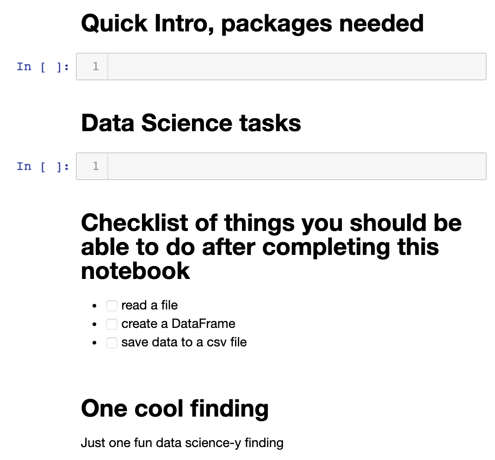

# Julia for Data Science
Prepared by [@nassarhuda](https://github.com/nassarhuda). Last updated: May 2020. Julia version used: 1.4.0

Accompanying videos are available at [JuliaAcademy](https://juliaacademy.com/p/julia-for-data-science).

There are three main components in this tutorial.
- Data (1 notebook)
- Methods (10 notebooks)
- Visualization (1 notebook)

What we **don't** cover:
- Setting up Julia.
    - Here is a youtube video on how to use Jupyter notebooks in Julia: https://youtube.com/watch?v=oyx8M1yoboY
    - Here is a youtube video on how to install, setup your IDE, and get started with plotting in Julia: https://www.youtube.com/watch?v=eXk9PXzuKXE&t=890s
- Intro to Julia.
    - If you have a fair programming experience in a different language or in Julia, I would say you can jump in to this tutorial, I try to keep all functions easy and simple to understand. Also, the first notebook covers a little bit of syntax.
    - If you have the gift of time, you can start with an Intro to Julia tutorial from [JuliaAcademy](https://juliaacademy.com/p/intro-to-julia).

----------------------------
# What we cover in more detail

Every data science task has one main ingredient, the **data**! Most likely, you want to use your data to learn something new. But before the **new** part, what about the data you already have? This is why our first section is on _Data_.  

### Data
In the first part we will make sure you can
- read and save your data via various File I/O options
- store, reformat, and process your data using different data structures.
- ⭐Bonus: we will also cover quick basic Julia syntax in case this is your first Julia experience.

---

Next, we will explore some of the most popular methods and tools used in Data Science to process this data.
### Methods
In this section, we hope to give you (the data scientist) all the tools you need to use Julia as a programming language for your data science tasks. This includes
- understanding how Linear Algebra and Statistics tasks are performed in Julia
- going through some of the most popular data science methods such as classification, regression, clustering, and more.
- calling your existing Python, R, or C code from Julia.
-----
And finally, we will go over a few visualizations that will hopefully reveal a few tips and tricks to generate good looking and informative visualizations.
### Visualization
Note that the methods section will show several kinds of plots too. But here, we will cover plotting tools that we didn't get to in the Methods section. This includes
- statiscs plots
- managing the axes (double axes)
- showing error bars
- managing colors and color schemes
- plot annotations.

--------
### This is what you should expect in every notebook

-----
#### And finally... Enjoy this tutorial!
